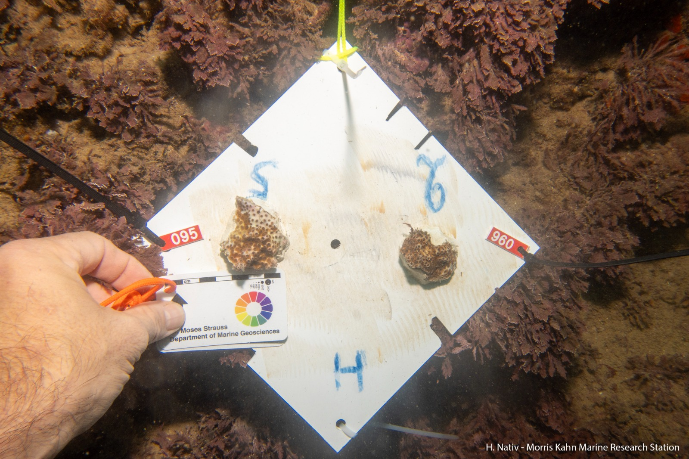
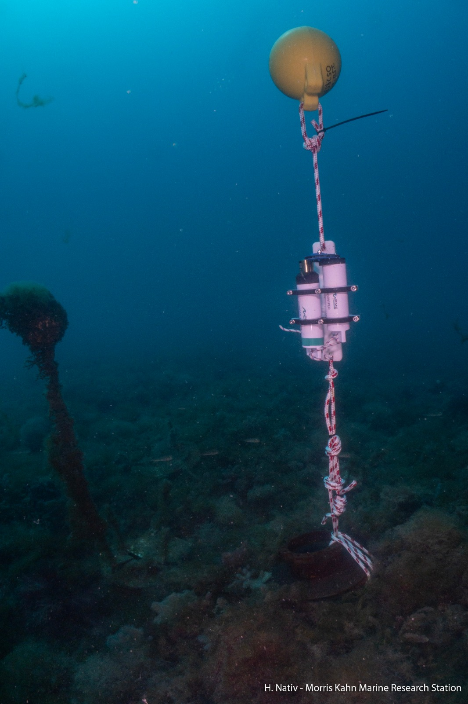

# Ocullina_Translocation

### Part of MOST project: Evaluating the mechanisms enabling temperate corals to persist and thrive in diverse environments 

The association between scleractinian corals and photosynthetic dinoflagellates is one of the most well-known nutritional symbioses in nature. Algal symbionts transfer most of their autotrophically-acquired nutrients to their coral hosts and in turn receive macromolecules gained through the coral host's heterotrophic feeding on plankton. Despite the importance of nutrition for coral growth and wellness, the precise role of the different partners in nutrient acquisition and allocation within the symbiosis still needs to be defined. This relationship is even more intriguing in symbiotic corals growing in relatively low light conditions such as at mesophotic depths (30 – 150 m) or in caves and overhangs. In this condition, the classic contribution of the symbionts donating photosynthetic products is seemingly less relevant and new questions on the reason(s) to maintain this partnership are rising. 
We aim to examine the mechanisms that enable corals to thrive across broad environmental gradients and determine whether differential food web dynamics and metabolism between host and symbionts are a result of plasticity or evolutionary adaptation. 

We conducted a reciprocal transplant study of *O. Patagonica*  in order to assess the effects of total irradiance on morphology and physiology in corals.  Six colonies were collected on 21.1.2024 at 3m at Sdot Yam and were split into 4. We transplanted each at 3, 10, 25, and 35 m in February 2024 after the recovery of the colonies from splitting. The 3 m samples were destroyed at the first storm so we replaced it with 10 m site. At each site we deployed Hobo and PAR meter 

As we lost the control at the origin site, at the end of the experiment, we collected additional colonies from the origin collection site as a control.

We recovered the corals during September-October 2024 

We will assess the corals for gene expression, morphology, biochemical and physiological endpoints. 

 

 
